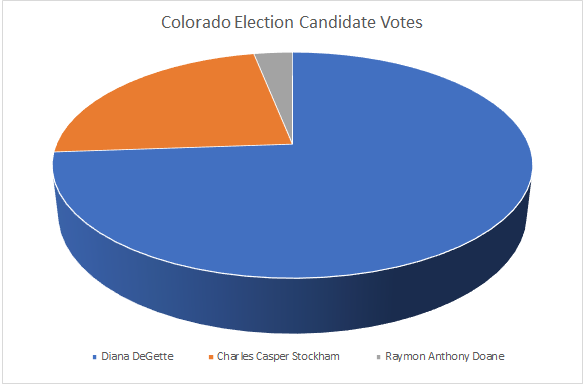
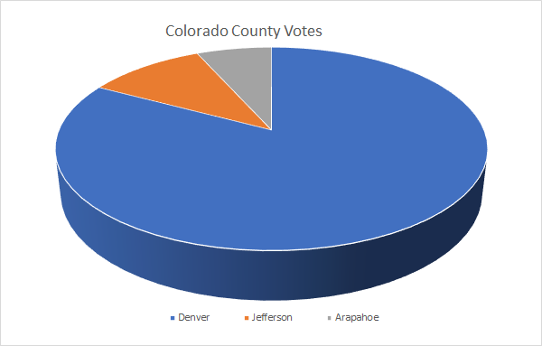

# Election_Analysis

## Project Overview
### Colorado Election Commission Audit

Hello Seth and Tom, here is an anlysis of the Colorado election with additional information by county.
Colorado hailed a total of 369,711 total votes cast. Of those votes, the top running candidates are  Diana DeGette, Charles Casper Stockham, and Raymon Anthony Doane. Diana DeGette swept the state with landslide **win** earning 272,892 of the state's vote. Next, Charles Casper Stockham earned 85,213 and lastly Raymon Anthony Doane carried a modest 11,606 votes. 

### **Diana DeGette    73.8%**
#### *Charles Casper Stockham 23.0%*
#### *Raymon Anthony Doane  3.1%*

##### **Congratulations to Diana DeGette for winning the Colorado Election**

## Resources
-Data Source: election_results.csv
-Software: Python 3.6.1, Visual Studio Code, 1.38.1

#Summary
The Analysis of the election show that:
- There were "x" votes cast in the election.
- The candidates were:
  -c 1
  -c 2
  -c 3
  -The candidate results were:
    -Candidate 1 received "x%" of the vote and "y" number of votes.
    -Can 2
    -Can 3
  -The winner of the election was:
    -Candidate (1, 2, or 3), who received "x%" of the vote and "y" number of votes.
    
    ##Challenge Overview
    
    ##Challenge Summary
    
