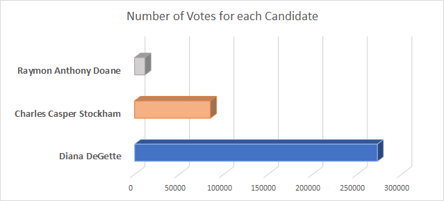

# Election_Analysis

## Project Overview
### Colorado Election Commission Audit

Hello Seth and Tom, here is an anlysis of the Colorado election with additional information by county.
Colorado hailed a total of 369,711 total votes cast. Of those votes, the top running candidates are  Diana DeGette, Charles Casper Stockham, and Raymon Anthony Doane. Diana DeGette swept the state with landslide **win** earning 272,892 of the state's vote. Next, Charles Casper Stockham earned 85,213 and lastly Raymon Anthony Doane carried a modest 11,606 votes. 

### **Diana DeGette    73.8%**
#### *Charles Casper Stockham 23.0%*
#### *Raymon Anthony Doane  3.1%*

Seth and Tom please see the attached voter information by county.  
**Denver** county collected the highest number of voters to the polls, **306,055!** That is 82.8% of voters from Denver county alone. Next, Jefferson county had 38,855 voters counting for 10.5% and the Arapahoe county collected 24,801 voters which is about 6.7% of the election participants. 

### **Denver    82.8%**
#### *Jefferson 10.5%*
#### *Arapahoe  6.7%*

# Summary
### **Congratulations to Diana DeGette for winning the Colorado Election**

Of Colorado state's 369,711 votes it appears Denver County carried the majority of the election with nearly 83% of Colorado's voting power. 

## Challenge Summary
This election audit was conducted with Python scripting software. This Visual Studio Code is written to pull specific data from a large Election_results database and print specific analyses to text. The election result data linked below is the full compilation of votes by ID, candidate and county. Seth and Tom, if you are interested an additional visulization may be compiled for another query. The percentage of each Colorado county's favorite candidates may be surmized with this same data set. Would you be interested to know if one of the three counties above was in particular favor of a specifc candidate? This kind of information may be helpful to know to prepare for the next election. Similarly this python script can be easily reused for an audit of an election in another state with a data source containing votes by ID, candidate and county for that state.
    
## Resources
-Data Source: 
-Software: Python 3.6.1, Visual Studio Code, 1.38.1
